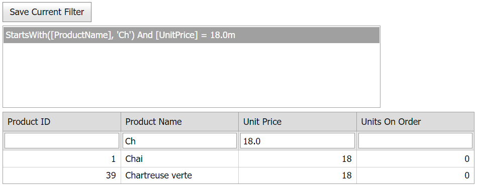

<!-- default badges list -->

[](https://supportcenter.devexpress.com/ticket/details/T361413)
[](https://docs.devexpress.com/GeneralInformation/403183)
<!-- default badges end -->
# Grid View for ASP.NET MVC - Access/modify a filter expression on the controller and save/load custom filters
<!-- run online -->
**[[Run Online]](https://codecentral.devexpress.com/t361413/)**
<!-- run online end -->

This example demonstrates how to use the [ListBox](https://docs.devexpress.com/AspNetMvc/DevExpress.Web.Mvc.ListBoxExtension) extension to pass a filter expression between the Controller, View, and client-side parts of an application.



## Overview

Handle the grid's [CustomJSProperties](https://docs.devexpress.com/AspNetMvc/DevExpress.Web.Mvc.GridViewSettings.CustomJSProperties) event and pass the current [FilterExpression](https://docs.devexpress.com/AspNet/DevExpress.Web.ASPxGridBase.FilterExpression) property value to the client.

```js
function OnClick(s, e) {
    if (GridView.cpFilterExpression)
        lbFilters.AddItem(GridView.cpFilterExpression);
}
```

```cshtml
settings.CustomJSProperties = (s, e) => e.Properties["cpFilterExpression"] = ((ASPxGridView)s).FilterExpression;
```

To pass the filter expression to the server, call the grid's client-side [PerformCallback](https://docs.devexpress.com/AspNetMvc/js-MVCxClientGridView.PerformCallback(data)) method.

```js
function OnSelectedIndexChanged(s, e) {
    GridView.PerformCallback({ filterExpression: lbFilters.GetSelectedItem().text });
}
```

Add the passed filter expression to the **ViewData** dictionary and handle the grid's [DataBound](https://docs.devexpress.com/AspNetMvc/DevExpress.Web.Mvc.GridSettingsBase.DataBound) event to to filter grid data based on the expression.

```cs
public ActionResult GridViewCustomActionPartial(string filterExpression) {
    ViewData["filterExpression"] = filterExpression;
    return PartialView("GridViewPartial", NorthwindDataProvider.GetProducts());
}
```

```cshtml
settings.DataBound = (s, e) => {
    if (ViewData["filterExpression"] != null)
        ((ASPxGridView)s).FilterExpression = ViewData["filterExpression"].ToString();
};
```

## Files to Review

* [HomeController.cs](./CS/Controllers/HomeController.cs) (VB: [HomeController.vb](./VB/Controllers/HomeController.vb))
* [GridViewPartial.cshtml](./CS/Views/Home/GridViewPartial.cshtml)**
* [Index.cshtml](./CS/Views/Home/Index.cshtml)

## Documentation

* [Passing Values to a Controller Action through Callbacks](https://docs.devexpress.com/AspNetMvc/9941/common-features/callback-based-functionality/passing-values-to-a-controller-action-through-callbacks)

## More Examples

* [Grid View for ASP.NET MVC - How to use a hidden column to edit data](https://github.com/DevExpress-Examples/gridview-how-to-implement-data-editing-with-hidden-column-e5121)
* [Grid View for ASP.NET MVC - How to use a list box to change the grid's layout](https://github.com/DevExpress-Examples/gridview-how-to-track-clientlayout-with-a-separate-listbox-t146962)
